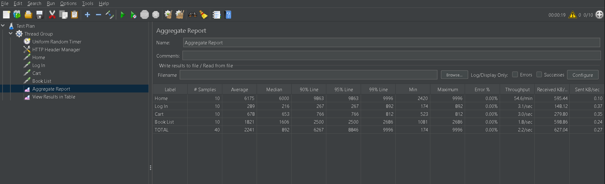

# 🧪 Performance Testing Using Apache JMeter  
**Project:** Performance Testing of [Rokomari.com](https://www.rokomari.com)  
**Author:** Md Nahid Hossain  
**Tool:** Apache JMeter  

---

## 📘 Project Overview  
This project focuses on evaluating the performance and response behavior of **Rokomari.com**, one of the largest online bookstores in Bangladesh.  
Using **Apache JMeter**, several test cases were created to simulate user actions and measure website performance metrics such as **response time**, **throughput**, and **error percentage**.

---

## 🎯 Objectives  
- Measure website performance under load.  
- Analyze response time for different pages.  
- Identify performance bottlenecks.  
- Evaluate throughput and error rates.  

---

## ⚙️ Test Plan Overview  
### Components Used:
- **Thread Group** – Defines the number of users and iterations.  
- **HTTP Header Manager** – Sets request headers.  
- **Uniform Random Timer** – Adds delay between requests.  
- **HTTP Requests**  
  - Home Page  
  - Log In Page  
  - Cart Page  
  - Book List Page  
- **Aggregate Report** – Provides overall performance metrics.  
- **View Results in Table** – Displays detailed sample results.  

---

## 📊 Results Summary  

### 🧩 Aggregate Report
| Label     | # Samples | Average (ms) | Min (ms) | Max (ms) | Error % | Throughput | Received KB/sec |
|------------|------------|---------------|-----------|-----------|-----------|--------------|-----------------|
| Home       | 10         | 6175          | 2420      | 9996      | 0.00%     | 54.6/min     | 595.44          |
| Log In     | 10         | 289           | 174       | 892       | 0.00%     | 3.1/sec      | 148.12          |
| Cart       | 10         | 678           | 523       | 812       | 0.00%     | 3.0/sec      | 279.80          |
| Book List  | 10         | 1821          | 1081      | 2686      | 0.00%     | 1.8/sec      | 598.86          |
| **TOTAL**  | **40**     | **2241**      | **174**   | **9996**  | **0.00%** | **2.2/sec**  | **627.04**      |

📷 **Screenshot:**  


---

### 📄 View Results in Table
This report displays each individual sample request with metrics such as **Sample Time**, **Latency**, **Connect Time**, and **Status**.

📷 **Screenshot:**  


---

## 📈 Observations  
- All requests completed successfully (**0% errors**).  
- The **Home page** had the highest response time (avg 6.1s).  
- The **Login page** was the fastest (avg 0.28s).  
- The overall average response time was **2.24s** across all pages.  
- Throughput indicates stable performance under a small load.  

---

## 🚀 How to Run This Test  

### Prerequisites  
- Install [Apache JMeter](https://jmeter.apache.org/download_jmeter.cgi)  
- Java 8+ must be installed and added to PATH.  

### Steps  
1. Clone this repository:  
   ```bash
   git clone https://github.com/nahid-10/performance_testing_using_jmeter.git
